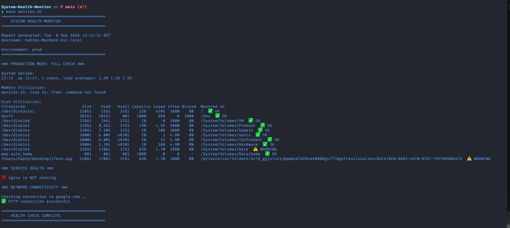
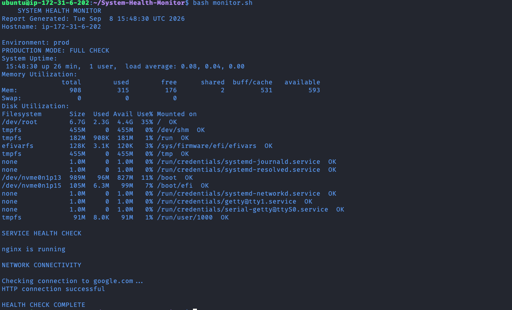

#Linux system Health Monitoring tool

#Overview
A Bash script that monitors the health of a Linux system by checking:
- Disk usage
- Memory utilisation
- NGINX service status

#Technologies used
- Bash
- Linux (ubuntu)
- SSH
- Git
- NGINX

#What I learned
- Bash scripting
- Linux command line
- Service management with systemctl
- Troubleshooting

## Example Output

Running locally on MacOS (local test)- some checks are Linux only and wont run natively on Mac

Running on Ubuntu (AWS EC2) — full check, as intended:

